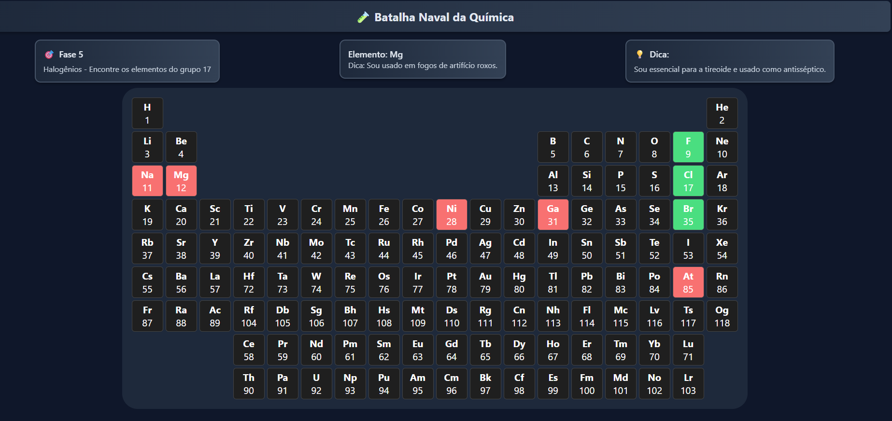

# 🧪 Batalha Naval da Química

Um jogo educativo estilo Batalha Naval para aprender sobre elementos químicos.



## 🎮 Como Jogar

1. O jogo tem 9 fases, cada uma com um tema diferente
2. Em cada fase, você precisa encontrar 4 elementos químicos
3. Use as dicas fornecidas para identificar os elementos
4. Clique no elemento que você acha que corresponde à dica
5. Elementos corretos ficarão verdes, incorretos ficarão vermelhos

## 🚀 Tecnologias

- React
- CSS
- JavaScript

## 💻 Como Executar

1. Clone o repositório
```bash
git clone https://github.com/seu-usuario/batalha-quimica.git
```

2. Entre na pasta do projeto
```bash
cd batalha-quimica
```

3. Instale as dependências
```bash
npm install
```

4. Inicie o servidor de desenvolvimento
```bash
npm start
```

5. Abra [http://localhost:3000](http://localhost:3000) para ver no navegador

## 📱 Recursos

- Interface intuitiva
- 9 fases temáticas
- Dicas educativas sobre cada elemento
- Design responsivo
- Visual moderno e atraente

## 🤝 Contribuindo

Contribuições são bem-vindas! Por favor, sinta-se à vontade para abrir um issue ou enviar um pull request.

